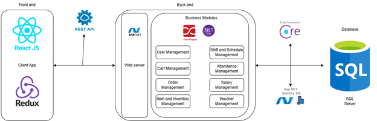

# Coffee Shop Management System

A comprehensive web-based application designed to streamline operations for coffee shops, including employee management, order processing, inventory tracking, and customer interactions.

## 1. Team Members

| No. | Student ID   | Full Name               | 
|-----|--------------|-------------------------|
| 1   | 22520190     | **Nguyen Luu Minh Dang (Leader)**    | 
| 2   | 21522808     | Vo Minh Vu              | 
| 3   | 22520020     | Nguyen Duy An           | 
| 4   | 22520187     | Bui Khanh Dang          | 
| 5   | 22520090     | Mai Thanh Bach          | 

## 2. Purpose and Reasons for Choosing the Topic

### Purpose
- Automate coffee shop operations: employee shifts, order management, inventory, and payroll.
- Replace manual processes with a digital solution to reduce errors and improve efficiency.
- Provide real-time analytics for business decisions.

### Reasons
- Growing demand for digital solutions in F&B management.
- Manual processes are time-consuming and prone to errors.
- Need for centralized data management across multiple locations.

## 3. Key Features

- **User Management**: Role-based access (Admin, Staff, Customer).
- **Shift Management**: Create shifts, assign staff, and track attendance.
- **Order Processing**: Handle in-store and online orders with multiple payment methods.
- **Inventory Management**: Track ingredients, set low-stock alerts, and manage suppliers.
- **Menu Management**: Add/update dishes, set promotions, and track availability.
- **Payroll System**: Automatically calculate salaries based on hours worked.
- **Reporting**: Generate sales, inventory, and employee performance reports.

## 4. Technologies Used

- **Frontend**: ReactJS, Redux, Material-UI
- **Backend**: ASP.NET Core, REST API
- **Database**: SQL Server, Entity Framework Core
- **Authentication**: JWT, ASP.NET Identity
- **Tools**: Visual Studio 2022, Swagger, Figma (UI Design)
- **Libraries**: AutoMapper

## 5. System Architecture
|  |
| :---------------------------: |
| _Overall Architecture_ |

- **Frontend**: Responsive UI built with ReactJS.
- **Backend**: Modular ASP.NET Core API handling business logic.
- **Database**: SQL Server for relational data storage.

## 6. User Guide
