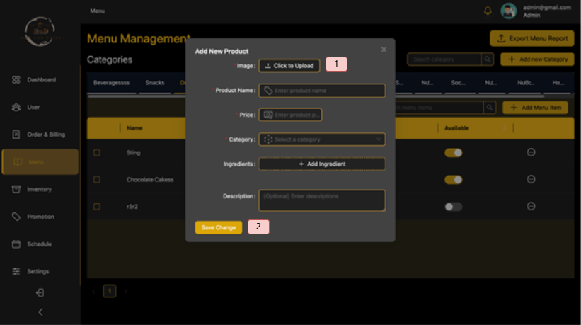

# Coffee Shop Management System

A comprehensive web-based application designed to streamline operations for coffee shops, including employee management, order processing, inventory tracking, and customer interactions.

## 1. Team Members

| No. | Student ID   | Full Name               | 
|-----|--------------|-------------------------|
| 1   | 22520190     | **Nguyen Luu Minh Dang (Leader)**    | 
| 2   | 21522808     | Vo Minh Vu              | 
| 3   | 22520020     | Nguyen Duy An           | 
| 4   | 22520187     | Bui Khanh Dang          | 
| 5   | 22520090     | Mai Thanh Bach          | 

## 2. Purpose and Reasons for Choosing the Topic

### Purpose
- Automate coffee shop operations: employee shifts, order management, inventory, and payroll.
- Replace manual processes with a digital solution to reduce errors and improve efficiency.
- Provide real-time analytics for business decisions.

### Reasons
- Growing demand for digital solutions in F&B management.
- Manual processes are time-consuming and prone to errors.
- Need for centralized data management across multiple locations.

## 3. Key Features

- **User Management**: Role-based access (Admin, Staff, Customer).
- **Shift Management**: Create shifts, assign staff, and track attendance.
- **Order Processing**: Handle in-store and online orders with multiple payment methods.
- **Inventory Management**: Track ingredients, set low-stock alerts, and manage suppliers.
- **Menu Management**: Add/update dishes, set promotions, and track availability.
- **Payroll System**: Automatically calculate salaries based on hours worked.
- **Reporting**: Generate sales, inventory, and employee performance reports.

## 4. Technologies Used

- **Frontend**: ReactJS, Redux, Material-UI
- **Backend**: ASP.NET Core, REST API
- **Database**: SQL Server, Entity Framework Core
- **Authentication**: JWT, ASP.NET Identity
- **Tools**: Visual Studio 2022, Swagger, Figma (UI Design)
- **Libraries**: AutoMapper

## 5. System Architecture
|  |
| :---------------------------: |
| _Overall Architecture_ |

- **Frontend**: Responsive UI built with ReactJS.
- **Backend**: Modular ASP.NET Core API handling business logic.
- **Database**: SQL Server for relational data storage.

## 6. User Guide

### **Admin - Staff:**

  
Dashboard Page

|  |  |
| :--------------------------------------: | :--------------------------------------: |
| _Admin Dashboard 1_ | _Admin Dashboard 2_ |

1. Dashboard Page.
2. Users Page.
3. Order & Billing Page.
4. Menu Page.
5. Inventory Page.
6. Promotion Page.
7. Schedule Page.
8. Settings Page.
9. Logout.

  
Users Page

   

  

  
User List

|  |
| :----------------------------------: |
| _User List Screen_ |

1. Update User Role.
2. Activate/Deactivate User.
3. View User Orders.

  

  

  
User Order History

|  |
| :----------------------------------: |
| _User Order History Screen_ |

  

  

  
Employee List

|  |
| :----------------------------------: |
| _Employee List Screen_ |

1. View Employee Details.
2. Remove Staff Role.
3. View Former Employee Details.

  

  

  
Employee Details

|  |
| :----------------------------------: |
| _Employee Details Screen_ |

1. Enter Hourly Wage Information.
2. Add New Hourly Wage.

  

  
Order & Billing Page

  

  
Order List

|  |
| :----------------------------------: |
| _Order List Screen_ |

1. Search Order.
2. Export Order List To CSV.
3. Create New Order.
4. View Order Details.

  
Order Details

|  |
| :----------------------------------: |
| _Order Details Screen_ |

1. Update Order Status.

  
Create New Order

|  |
| :----------------------------------: |
| _Create New Order Screen_ |

1. Search Food Name.
2. Select Food Type.
3. Select Food.
4. Change Food Quantity.
5. Remove Food From Order.
6. Enter Promotion For Order.
7. Apply Selected Promotion For Order.
8. Place Order.

  
Create New Order - Payment

|  |
| :----------------------------------: |
| _Create New Order Payment Screen_ |

1. Select Payment Method.
2. Money Customer Has Already Given.
3. Submit Payment.

  
Create New Order - Print Invoice

|  |
| :----------------------------------: |
| _Print Invoice Screen_ |

1. Print Order.
2. Done

  
Ingredient Import History & List

|  |  |
| :----------------------------------------------: | :--------------------------------------: |
| _Ingredient Import History_ | _Ingredient List_ |

  
Create New Product & Product Details

|  |  |
| :--------------------------------------------: | :----------------------------------------: |
| _Create New Product_ | _Product Details_ |

  
Create New Promotion & Edit Promotion

|  |  |
| :----------------------------------------------: | :--------------------------------------: |
| _Create New Promotion_ | _Edit Promotion_ |

### **Riêng:**

  
Product List

|  |
| :----------------------------------: |
| _Product List Screen_ |

  
Promotion List

|  |
| :----------------------------------: |
| _Promotion List Screen_ |

  
Shift Assignments

|  |
| :----------------------------------: |
| _Shift Assignments Screen_ |

  
Create New Shift

|  |
| :----------------------------------: |
| _Create New Shift Screen_ |

  
Shift List

|  |
| :----------------------------------: |
| _Shift List Screen_ |

  
Add to Cart

|  |
| :----------------------------------: |
| _Add to Cart Screen_ |

  
Cart

|  |
| :----------------------------------: |
| _Cart Screen_ |

  
Checkout

|  |
| :----------------------------------: |
| _Checkout Screen_ |

  
Landing Page

|  |
| :----------------------------------: |
| _Landing Page Screen_ |

  
Menu

|  |
| :----------------------------------: |
| _Menu Screen_ |

  
Order History Details

|  |
| :----------------------------------: |
| _Order History Details Screen_ |

  
Order History List

|  |
| :----------------------------------: |
| _Order History List Screen_ |

  
Personal Information

|  |
| :----------------------------------: |
| _Personal Information Screen_ |

